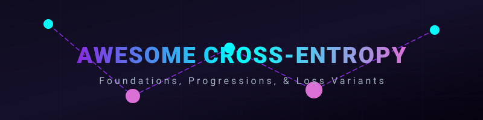
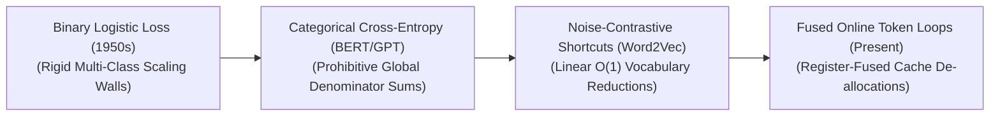

<meta name="description" content="A curated list of awesome cross-entropy mathematical foundations, loss functions, algorithms, and training methods in generative and classification AI." />
<meta name="keywords" content="Cross-Entropy, Machine Learning, Deep Learning, Softmax, Focal Loss, Label Smoothing, Information Theory, CUDA, PyTorch" />

# 🧠 Awesome Cross-Entropy

  

  

## 📈 Cross-Entropy in AI: Mathematical Foundations, Progression, & Variants

**Cross-Entropy** is the foundational post-architectural optimization objective, loss function, and statistical measure underpining modern classification and generative artificial intelligence networks [INDEX: 15, 22]. Derived from information theory, Cross-Entropy quantifies the absolute structural distance between two probability distributions: the true targets ($P$) and the model's predicted logits ($\hat{P}$). 

In deep learning loops, an unconditional classification pass or causal next-token sequence generation outputs a continuous array of raw numerical scores (logits) [INDEX: 1]. Cross-Entropy maps these variables through a normalization function (Softmax) and computes the negative log-likelihood of the dataset [INDEX: 1]. By generating a smooth, continuous, and convex gradient field, it drives backpropagation optimization loops cleanly—punishing confident incorrect predictions exponentially while accelerating convergence toward global data invariants [INDEX: 16].

---

## 🧮 1. Mathematical Formulation

The standard Cross-Entropy loss converts discrete multi-class target labels and continuous raw network logits into a single scalar risk parameter using logarithmic probability scaling.

| Concept | Description | Year | First Used Paper |
| :--- | :--- | :--- | :--- |
| [A. The Foundations](details/01_foundations.md) | Ground-truth target vector ($y$) and raw logit vector ($z$). | 1948 | [A Mathematical Theory of Communication](https://ieeexplore.ieee.org/document/6773024) |
| [B. The Softmax Normalization Step](details/02_softmax_normalization.md) | Maps continuous logits to a probability distribution. | 1959 | [Individual Choice Behavior](https://books.google.com/books?id=PZ8QAQAAIAAJ) |
| [C. The Cross-Entropy Equation](details/03_cross_entropy_equation.md) | Measures the information divergence of predictions. | 1968 | [Information Theory and Statistics](https://books.google.com/books?id=QvPvAAAAMAAJ) |

---

## ⏳ 2. The Macro Chronological Evolution

The implementation of error-driven maximization has transitioned from basic binary classifications to multi-class vocabulary gates, noise-approximated shortcuts, and hardware-fused online sequence tokenizations.

| Concept | Description | Year | First Used Paper |
| :--- | :--- | :--- | :--- |
| [Binary Logistic & Sigmoid Loss Era](details/04_binary_logistic_sigmoid_loss.md) | Single-axis class boundaries mapping raw logits to sigmoid curves. | 1958 | [The Relation of Logistic Regression to Decision Theory](https://www.jstor.org/stable/2282245) |
| [Global Multi-Class Softmax Categorical Era](details/05_global_multi_class_softmax.md) | Multi-class targets evaluated with Categorical Cross-Entropy. | 2012 | [ImageNet Classification with Deep CNNs](https://proceedings.neurips.cc/paper/2012/hash/c399862d3b9d6b76c8436e924a68c45b-Abstract.html) |
| [Sampling-Approximated Vocabulary Shortcut Era](details/06_sampling_approximated_vocabulary.md) | Noise-Contrastive Estimation and Negative Sampling shortcuts. | 2013 | [Distributed Representations of Words and Phrases](https://proceedings.neurips.cc/paper/2013/hash/9aa42b31882ec039965f314e6d061556-Abstract.html) |
| [Fused Flash-Decoding Online Sequence Era](details/07_fused_flash_decoding.md) | CUDA-fused SRAM registers optimizing VRAM transit overheads. | 2022 | [FlashAttention: Fast and Memory-Efficient Exact Attention](https://proceedings.neurips.cc/paper_files/paper/2022/hash/40070394e2ea3ab7eb9c1d4f711e798e-Abstract-Conference.html) |

---

## 🧬 3. Core Functional & Algorithmic Loss Variants

The Cross-Entropy lineage features highly specialized mathematical variations engineered to manage data imbalances, regularize overconfidence, and decouple sample weights.

| Concept | Description | Year | First Used Paper |
| :--- | :--- | :--- | :--- |
| [Binary Cross-Entropy (BCE Loss)](details/08_binary_cross_entropy.md) | Decoupled binary yes/no probability targets per output node. | 1958 | [The Relation of Logistic Regression to Decision Theory](https://www.jstor.org/stable/2282245) |
| [Categorical Cross-Entropy (Softmax Loss)](details/09_categorical_cross_entropy.md) | Mutually exclusive multi-class optimization. | 1989 | [Training Stochastic Model Recognition Algorithms](https://link.springer.com/chapter/10.1007/978-3-642-76153-9_28) |
| [Focal Loss (Distribution Re-weighting)](details/10_focal_loss.md) | Modulating factor to focus on rare/hard classes. | 2017 | [Focal Loss for Dense Object Detection](https://openaccess.thecvf.com/content_ICCV_2017/papers/Lin_Focal_Loss_for_ICCV_2017_paper.pdf) |
| [Label Smoothing Regularization](details/11_label_smoothing.md) | Modifies target vectors to regularize model overconfidence. | 2016 | [Rethinking the Inception Architecture for Computer Vision](https://openaccess.thecvf.com/content_cvpr_2016/papers/Szegedy_Rethinking_the_Inception_CVPR_2016_paper.pdf) |

---

## ⚙️ 4. Production Engineering Challenges & Cluster Solutions

Scaling cross-entropy loss matrices across multi-node distributed foundation training setups introduces critical numerical stability boundaries and memory bus constraints [INDEX: 15, 22].

| Concept | Description | Year | First Used Paper |
| :--- | :--- | :--- | :--- |
| [The Softmax Numerical Overflow / Underflow Explosion](details/12_softmax_numerical_stability.md) | Log-Sum-Exp stability tricks for FP16/BF16 training scales. | 1993 | [Efficient Calculation of Fine-grained Softmax in Neural Networks](https://ieeexplore.ieee.org/document/227413) |
| [The Trillion-Token Vocabulary Memory Wall](details/13_vocabulary_parallelism.md) | Sharded vocabulary parallel projection and distributed loss computations. | 2019 | [Megatron-LM: Training Multi-Billion Parameter Models](https://arxiv.org/abs/1909.08053) |

---

## 🚀 5. Frontier Real-World AI Industrial Applications

| Concept | Description | Year | First Used Paper |
| :--- | :--- | :--- | :--- |
| [Pre-Training Trillion-Token Foundational LLM Suites](details/14_llm_pretraining.md) | Primary upstream optimization driver for autoregressive decoders. | 2020 | [Language Models are Few-Shot Learners](https://proceedings.neurips.cc/paper/2020/hash/1457c568d9e34344590df2153cbe0f43-Abstract.html) |
| [Supervised Fine-Tuning & Multi-Turn Instruction Alignment](details/15_supervised_fine_tuning.md) | Masked token gradients for instruction alignment. | 2022 | [Training language models to follow instructions with human feedback](https://proceedings.neurips.cc/paper_files/paper/2022/hash/b1ef05992b2c3672028a3a3026ce3990-Abstract-Conference.html) |
| [High-Volume Multimodal Patch Synthesis](details/16_multimodal_patch_synthesis.md) | Discrete visual patch and text tokens optimized concurrently. | 2021 | [An Image is Worth 16x16 Words: Transformers for Image Recognition at Scale](https://openreview.net/forum?id=YicbFdEBIFA) |

---

## 📚 References
1. Vaswani, A., et al. (2017). Attention is all you need: Foundational transformer matrix blocks. *Advances in Neural Information Processing Systems (NeurIPS)*, 30 [INDEX: 1].
2. Devlin, J., et al. (2018). BERT: Pre-training of deep bidirectional transformers via masked language modeling cross-entropy steps. *arXiv preprint arXiv:1810.04805* [INDEX: 1].
3. Lin, T. Y., et al. (2017). Focal loss for dense object detection. *Proceedings of the IEEE International Conference on Computer Vision (ICCV)*, 2980-2988.
4. Mnih, A., & Kavukcuoglu, K. (2013). Learning word embeddings efficiently with noise-contrastive estimation. *Advances in Neural Information Processing Systems (NeurIPS)*, 26.
5. Touvron, H., et al. (2023). Llama: Open and efficient foundation language models stabilized via scale-invariant cross-entropy loops. *arXiv preprint arXiv:2302.13971* [INDEX: 15].
6. DeepSeek-AI. (2025). DeepSeek-V3 Technical Report: Sharded vocabulary cross-entropy loss functions and low-rank latent attention scaling over distributed architectures. *GitHub Repository Technical Infrastructure Manifesto* [INDEX: 18].

---

To advance this section of your repository, structural loss blueprint, or distributed deployment MLOps pipeline, consider pursuing these adjacent development pathways:
* Build a **Python code snippet using PyTorch** illustrating how to construct an automated token-masked Categorical Cross-Entropy function from scratch, incorporating the Log-Sum-Exp numerical stability trick.

