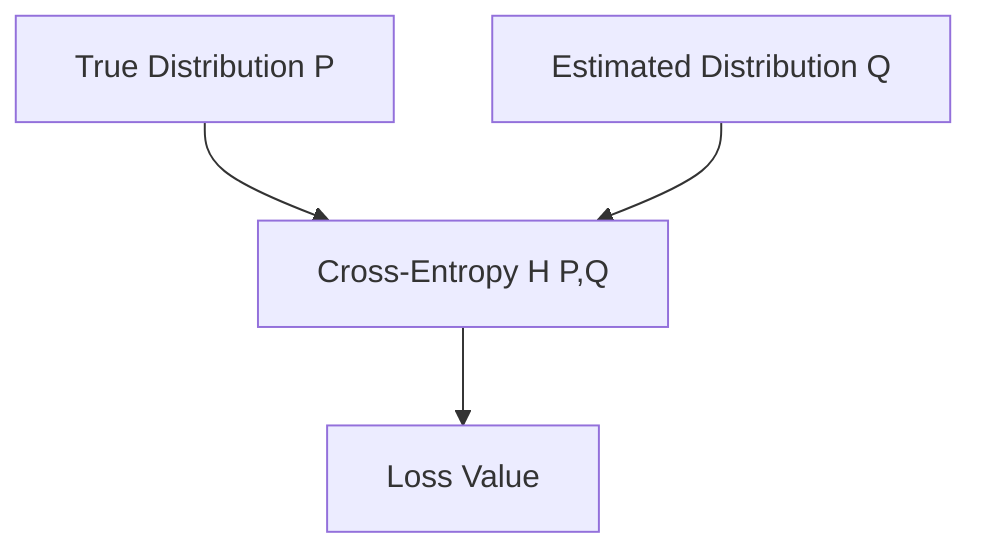

# A. The Foundations of Cross-Entropy

Cross-Entropy finds its mathematical roots in Claude Shannon's 1948 seminal work on Information Theory. It measures the average number of bits needed to identify an event from a set of possibilities, if a coding scheme is used based on an estimated probability distribution rather than the true distribution.

## Mathematical Definitions
- **Entropy ($H(P)$):** The minimum average number of bits required to encode the outcomes of a random variable following distribution $P$.
  $$H(P) = -\sum_{x} P(x) \log P(x)$$
- **Cross-Entropy ($H(P, Q)$):** The average number of bits required to encode outcomes from distribution $P$ using an estimated distribution $Q$.
  $$H(P, Q) = -\sum_{x} P(x) \log Q(x)$$

## Architecture Diagram

[Back to README](../README.md)
