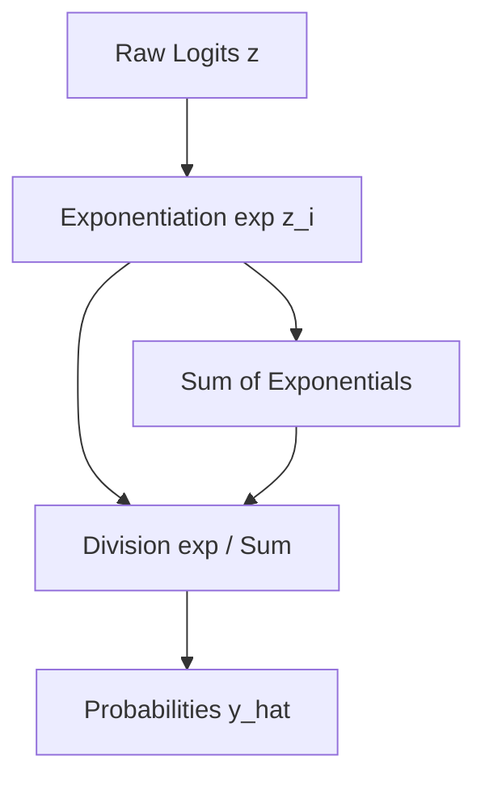

# B. The Softmax Normalization Step

Softmax normalization maps raw unconstrained logits output by a neural network to a valid probability distribution.

## Mathematical Formulation
For logit vector $z$:
$$\hat{y}_i = \text{Softmax}(z)_i = \frac{\exp(z_i)}{\sum_{j=1}^{K} \exp(z_j)}$$

This ensures:
1. $\hat{y}_i \in [0, 1]$ for all $i$.
2. $\sum_{i=1}^{K} \hat{y}_i = 1$.

## Architecture Diagram

[Back to README](../README.md)
