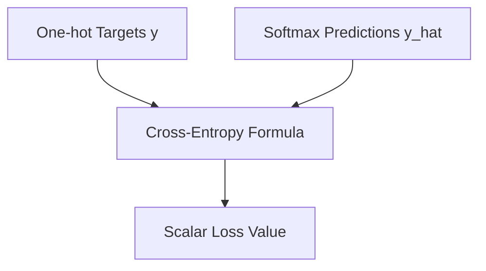

# C. The Cross-Entropy Equation

The Cross-Entropy equation computes the loss by comparing the target probability distribution against the normalized predicted probabilities.

## Mathematical Formulation
$$\mathcal{L}_{\text{CE}}(y, \hat{y}) = -\sum_{i=1}^{K} y_i \log(\hat{y}_i)$$

For one-hot targets where only index $c$ is active:
$$\mathcal{L}_{\text{CE}}(y, z) = -z_c + \ln \sum_{j=1}^{K} \exp(z_j)$$

## Diagram

[Back to README](../README.md)
