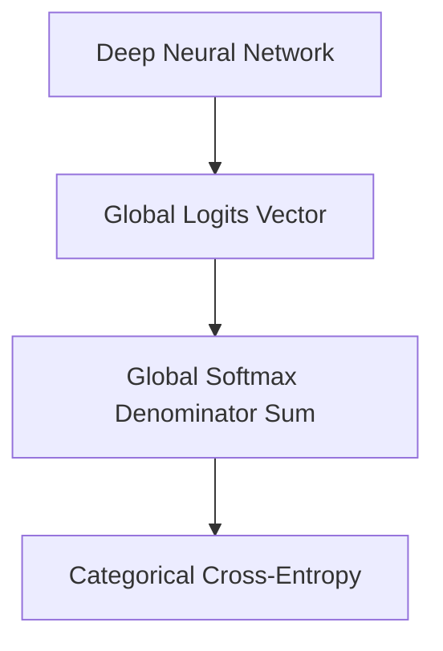

# Global Multi-Class Softmax Categorical Era

Standard categorical cross-entropy with global Softmax scales neural networks to handle multi-class target domains (e.g. classification, token predictions).

## Concept
Evaluates the complete probability vector over the entire vocabulary or category space.

## Diagram

[Back to README](../README.md)
