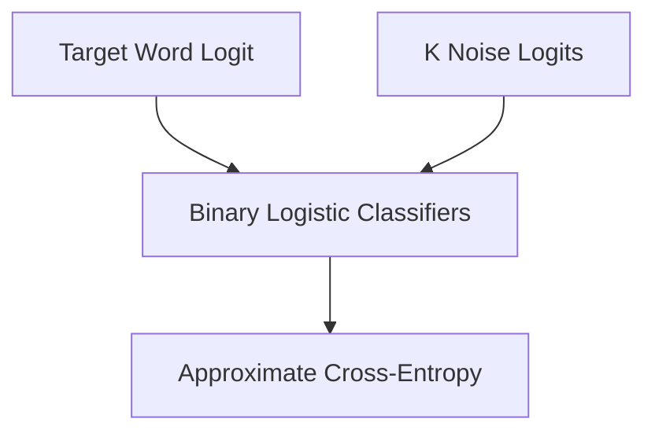

# Sampling-Approximated Vocabulary Shortcut Era

To bypass the expensive $O(|\mathcal{V}|)$ computation of global Softmax, approximate techniques like Noise-Contrastive Estimation (NCE) and Negative Sampling were developed.

## Concept
Instead of normalising over all words, classify the target word against $k$ noise samples.

## Diagram

[Back to README](../README.md)
