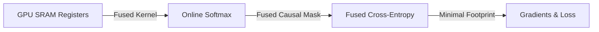

# Fused Flash-Decoding Online Sequence Era

Modern training clusters use register-fused execution kernels to perform online softmax and cross-entropy computations directly within GPU SRAM.

## Concept
Bypasses the write-back of large intermediate logit tensors to High Bandwidth Memory (HBM).

## Diagram

[Back to README](../README.md)
