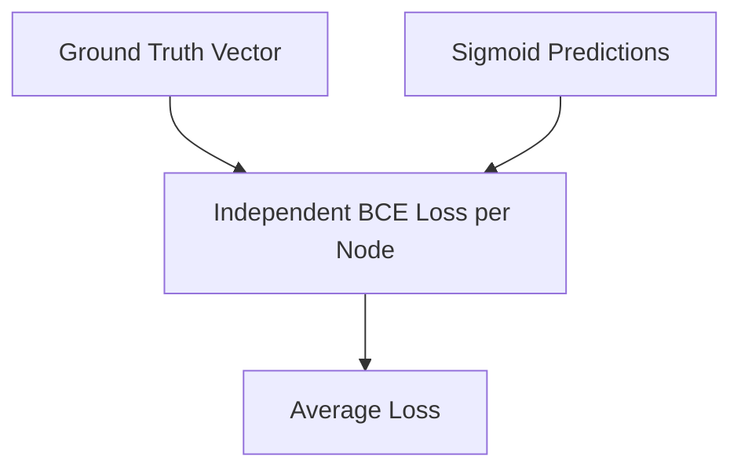

# Binary Cross-Entropy (BCE Loss)

BCE Loss is used for multi-label classification tasks where categories are not mutually exclusive.

## Mathematical Formulation
$$\mathcal{L}_{\text{BCE}} = -\frac{1}{N} \sum_{i=1}^{N} [y_i \log(\hat{y}_i) + (1 - y_i) \log(1 - \hat{y}_i)]$$

## Diagram

[Back to README](../README.md)
