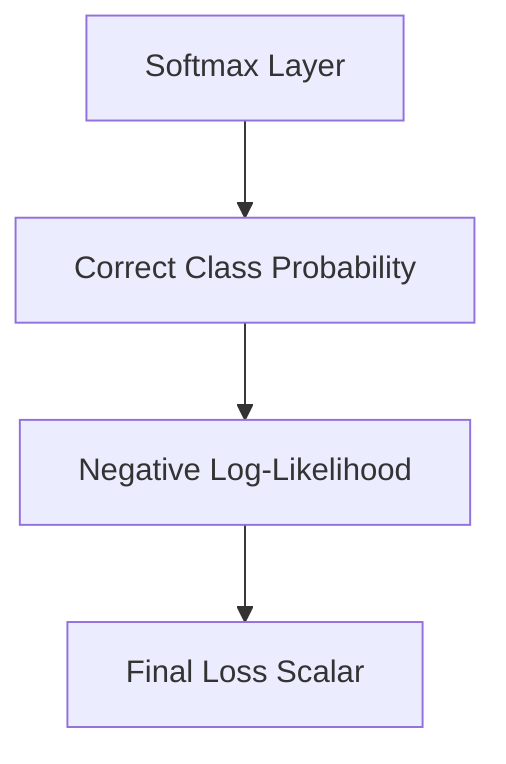

# Categorical Cross-Entropy (Softmax Loss)

Categorical Cross-Entropy is applied when targets are mutually exclusive classes.

## Concept
It pushes the model to maximize the probability of the correct class while minimizing the rest.

## Diagram

[Back to README](../README.md)
