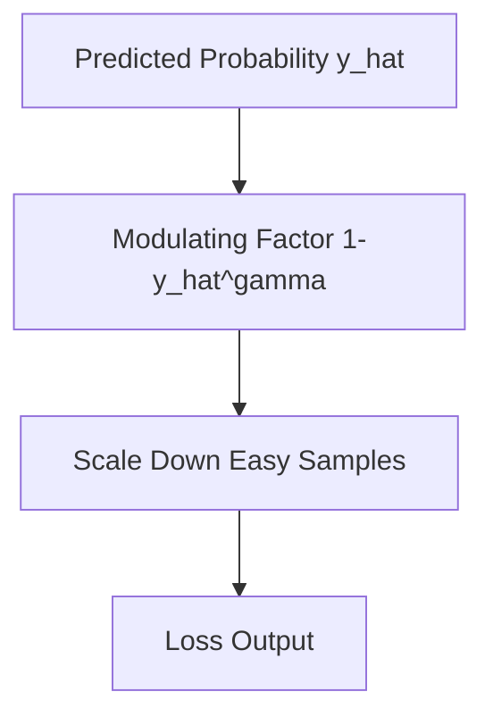

# Focal Loss (Distribution Re-weighting)

Focal Loss is engineered to solve severe foreground-background class imbalances by dynamically down-weighting the loss of easy samples.

## Mathematical Formulation
$$\mathcal{L}_{\text{Focal}} = -\alpha_t (1 - \hat{y}_t)^\gamma \log(\hat{y}_t)$$

## Diagram

[Back to README](../README.md)
