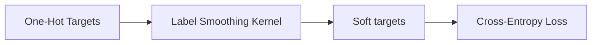

# Label Smoothing Regularization

Label smoothing regularizes networks against overconfidence by distributing a small probability mass uniformly across all classes.

## Mathematical Formulation
$$y_i^{\text{smoothed}} = y_i(1 - \epsilon) + \frac{\epsilon}{K}$$

## Diagram

[Back to README](../README.md)
