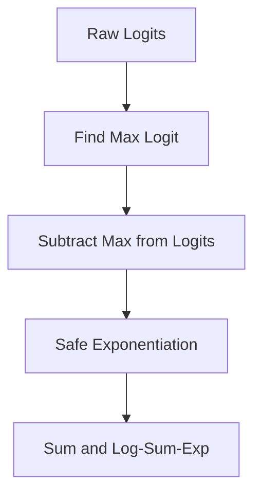

# The Softmax Numerical Overflow / Underflow Explosion

To prevent floating-point representation limits from overflowing when calculating exponentials, compilers apply the Log-Sum-Exp identity.

## Mathematical Formulation
$$\ln \sum \exp(z_i) = z_{\text{max}} + \ln \sum \exp(z_i - z_{\text{max}})$$

## Diagram

[Back to README](../README.md)
