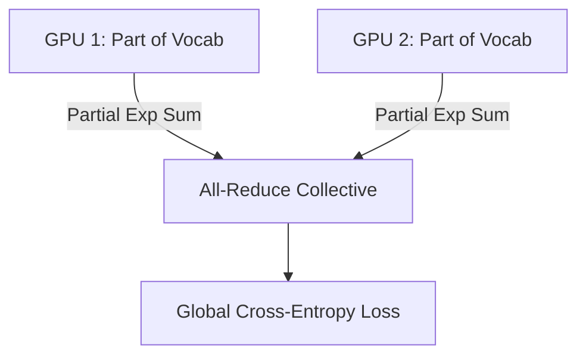

# The Trillion-Token Vocabulary Memory Wall

Vocabulary Parallelism shards the final linear layers and loss calculation across multiple GPUs to reduce peak memory consumption.

## Concept
Split the massive vocabulary projection matrix and calculate partial softmax denominators across GPU partitions.

## Diagram

[Back to README](../README.md)
