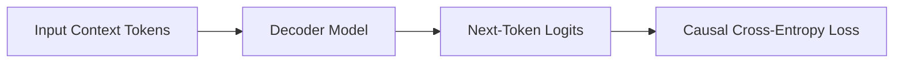

# Pre-Training Trillion-Token Foundational LLM Suites

Standard cross-entropy loss is the engine behind pre-training autoregressive foundation models.

## Concept
Predicts the next token in the sequence given the preceding context window.

## Diagram

[Back to README](../README.md)
