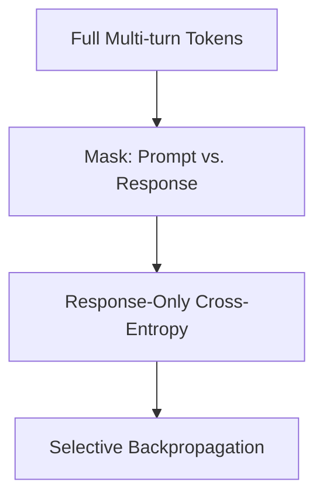

# Supervised Fine-Tuning & Multi-Turn Instruction Alignment

In SFT, cross-entropy is calculated only on selected sequence tokens representing the model response, ignoring input prompt tokens.

## Concept
Mask out prompt logit gradients to prevent standard pre-training losses from overriding instruction tuning goals.

## Diagram

[Back to README](../README.md)
