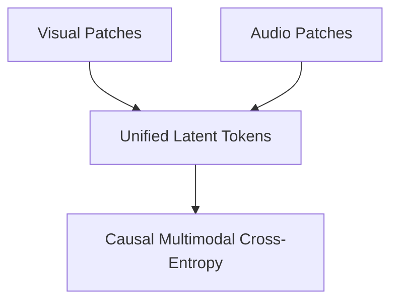

# High-Volume Multimodal Patch Synthesis

Visual patches, audio spectrograms, and token sequences are flattened and optimized concurrently using unified cross-entropy projections.

## Concept
Treating vision and sound patches as discrete codebook indices in multimodal generator networks.

## Diagram

[Back to README](../README.md)
